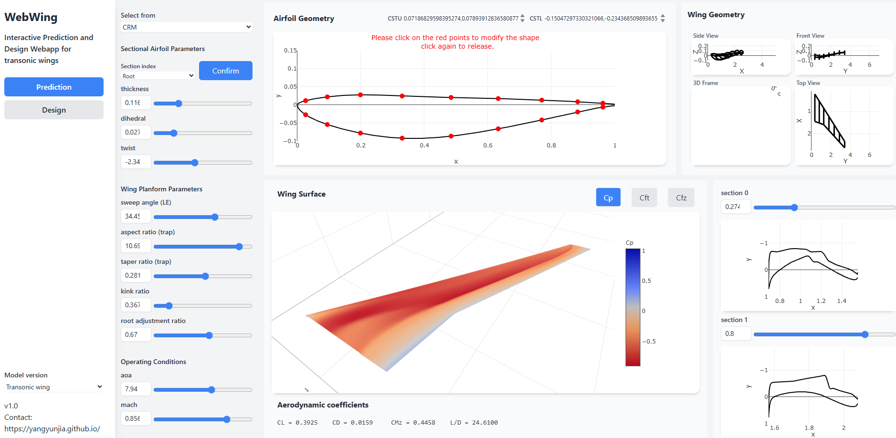
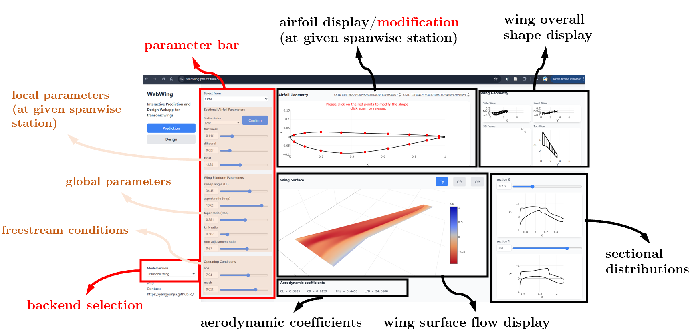

# Web-wing - Interactive Transonic Wing Design App

Here we provide an interactive application of our pre-trained prediction model for transonic wings. It is running remotely and can give you almost instant respond on the crucial **RANS-level** wing aerodynamics (including coefficients and surface pressure / friction distributions). 

Our App have currently two backends:

- **Simple Wings** with one segment. This backend implements the physics-embedded transfer learning (use the aerodynamics from 2D sectional airfoil as a prior). 

- **Two-segment Transonic Wings** Facing the up-to-date wing configuration, this backend utilize the AeroTransformer, the *largest* base model for wing aerodynamics.

You can access to the app at [TUM website](https://webwing.pbs.cit.tum.de/). Feel free to modify the airfoil geometry, wing planform geometry, and wing operating conditions to see what will happen on the wing surface flow field, and your knowledge on wing aerodynamics will grow.

The next step of the app is a gradient optimization tool for wing performance, which will come soon.

## Local Installation

If you want to run the app locally, please follow the steps below to run the code.

1. Install required packages

    The web-Wing requires `einops numpy scipy tqdm huggingface_hub` and `pytorch` to be installed. The local user interface can be implemented with `flask`. You can install them with `pip` or `conda`. Please be careful to the version of `pytorch` to match your local GPU. 

2. Download libraries

    The web-Wing requires three projects: `floGen`, `cfdpost`, and `cst-modeling3d` on [GitHub](https://github.com/YangYunjia). You can download the latest version from repositories, and unzip them. Intall three libraries with running `pip install . -e` at the root directory of each library.

Then, the wing-app should be able to start.

1. Start local server

    change directory to `<webwing folder>/webwing/` and run `python app.py`. Pretrained models should be automatically downloaded.

2. Start browser

    go to `127.0.0.1:5000` in your browser.

## User guide

WebWing comes with bars and panels for interacting as follows:

- backend selection
- parameter bars
    - **select from**: existing wing parameters inside dataset
    - **local parameters at selected spanwise station**: select the station with the `section index` dropbox (for simple wing, the sectional airfoil shape is fixed to a `baseline airfoil`), then modify the local parameters. 

        |Parameter|Symbol	|Definition|Range (Simple)| Range (Transonic) | Comments|
        |-|-|-|-|-|-|
        |Max. Rela. thickness| $ (t/c)_\text{max}$ | | 0.08 - 0.13 | 0.08 - 0.17 | for simple wings, value entered here describes the root airfoil|
        |dihedrals| $ \Delta z_\text{LE}$ | difference in L.E z heights between two sections | N/A | 0 - 0.15 | |
        |twists| $ \Delta \alpha_\text{tw}$ | difference in twists between two sections | N/A | -4.0 - 0 | |
    
        By clicking the `Modify airfoil`  botton, one can further modify airfoil shape by dragging control points/changing CST coefficients (both upper `CSTU` and lower `CSTL` surfaces described with 9th order CST, corresponding to 10 coefficients. Definition of CST parameters can be found in `cst-modeling3d`).
    - **Wing Planform Parameters** Global wing shape parameters.

        The parameters include:

        |Parameter|Symbol	|Definition|Range (Simple)| Range (Transonic) | Comments|
        |-|-|-|-|-|-|
        |sweep angle	|$\Lambda_\text{LE}$	| |0° - 35°| 25° - 40° | leading edge|
        |dihedral angle	|$\Gamma_\text{LE}$	| |0° - 3°| N/A | leading edge|
        |aspect ratio	|$AR$	| $\frac{b_{1/2}^2}{2S_{1/2}}$ |6 - 10| 8 - 11| $S_{1/2}$ based on trapezoidal part
        |tapper ratio	|$TR$	| $\frac{c_\text{tip}}{c_\text{root}}$ | 0.2 - 1.0| 0.15 - 0.4 | $c_\text{root}$ based on trapezoidal part
        |tip twist angle	|$\alpha_\text{twist}$	||0° - -6°| N/A
        |tip-to-root thickness ratio |$r_t$	||0.8 - 1| N/A
        |kink location  |$\eta_k$	|| N/A |0.36 - 0.42| 
        |root adjustment ratio  |$\kappa$	| `0` -> trap wing; `1` -> inner segment has horizontal tailing edge | N/A |0.1 - 1.1| 

    - Operating conditions
        |Parameter|Symbol	|Definition|Range (Simple)| Range (Transonic) | Comments|
        |-|-|-|-|-|-|
        | AOA | $\alpha$ | | 1° - 6°| 2° - 12° | without installation angle |
        |Mach | $Ma$ || 0.72 - 0.85 | 0.72 - 0.9

        Due to the limited training sample, the results under large $AOA$s / $Ma$s may have large error

    These values can be input with text box and scroll bars. You can also select the training wing parameters with `select from` droplist.
<!-- 
## How it works

The model used here is the 2d-to-3d transfer model. We first build a model to predict 2d airfoil flow field, and then use it as a prior for 3d flow field prediction.

The UI is implemented with `Flask`. -->

## To cite this work

### Simple wing

1.	Yang Y, Li R, Zhang Y, Lu L, Chen H. Rapid aerodynamic prediction of swept wings via physics-embedded transfer learning, *AIAA Journal*, 2025. https://arc.aiaa.org/doi/10.2514/1.J064576.

2.	Yang Y, Li R, Zhang Y, Lu L, Chen H. Transferable machine learning model for the aerodynamic prediction of swept wings, *Physics of Fluids*, 2024. https://doi.org/10.1063/5.0213830.

### Transonic wing

1.	Yang Y, Tang W, Liu M, Thuerey N, Zhang Y, and Chen H. SuperWing: A Comprehensive Transonic Wing Dataset for Data-Driven Aerodynamic Design, 2025. https://arxiv.org/abs/2512.14397.
