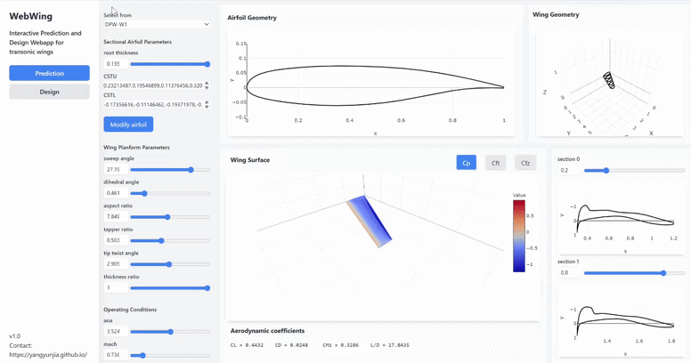
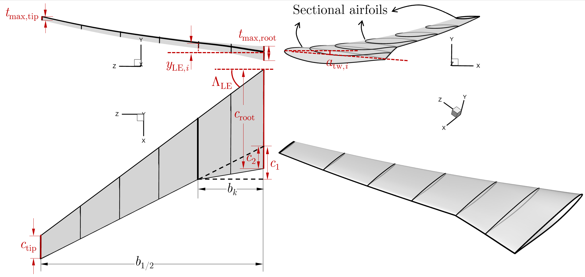
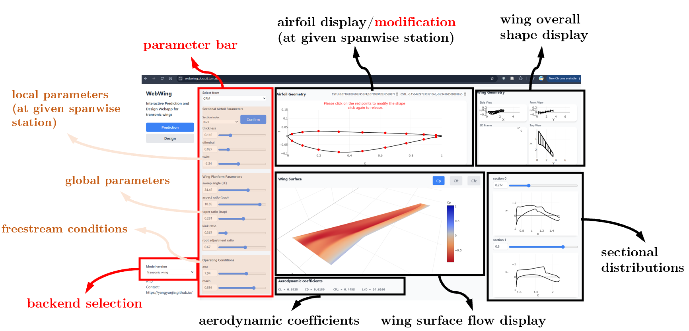

# WebWing - Interactive Transonic Wing Design App

WebWing is an interactive web application for real-time aerodynamic prediction of transonic wings. It leverages pre-trained machine learning models to provide **RANS-level predictions**, including:

* Aerodynamic coefficients (lift, drag, pitching moment)
* Surface pressure / friction distribution ($C_p$)

👉 **Try it online:** [https://webwing.pbs.cit.tum.de/](https://webwing.pbs.cit.tum.de/)

## ✨ Features

WebWing currently supports two aerodynamic backends:

**1. Simple Wings (Single Segment)**

* Designed for basic wings from non-sweep to swept wings
* Uses **physics-embedded transfer learning** which incorporates 2D airfoil aerodynamics as prior knowledge

    ```
    1.	Yang Y, Li R, Zhang Y, Lu L, Chen H. Rapid aerodynamic prediction of swept wings via physics-embedded transfer learning, *AIAA Journal*, 2025. https://arc.aiaa.org/doi/10.2514/1.J064576.


    2.	Yang Y, Li R, Zhang Y, Lu L, Chen H. Transferable machine learning model for the aerodynamic prediction of swept wings, *Physics of Fluids*, 2024. https://doi.org/10.1063/5.0213830.
    ```

**2. Two-Segment Transonic Wings**

* Supports modern, more complex two-segment wing geometries and varying airfoil shape along spanwise.
* Powered by [AeroTransformer](https://github.com/tum-pbs/AeroTransformer), one of the largest-scale aerodynamic base models
* Achieves ~**1.2% error** in coefficient prediction within typical flight regimes

    ```
    1.	Yang Y, Tang W, Liu M, Thuerey N, Zhang Y, and Chen H. SuperWing: A Comprehensive Transonic Wing Dataset for Data-Driven Aerodynamic Design, 2025. https://arxiv.org/abs/2512.14397.

    2. Yang Y, Gholami B, Guerbuz C, Rashed M, and Thuerey N. Towards a Foundation-Model Paradigm for Aerodynamic Prediction in Three-dimensional Design, 2026. https://arxiv.org/abs/2604.18062.
    ```

## 🚀 What You Can Do

* Modify **airfoil geometry**
* Adjust **wing planform parameters**
* Change **operating conditions**
* Instantly observe how flow physics (e.g., shock waves) respond

This makes WebWing both a **design exploration tool** and an **intuitive learning environment** for aerodynamics.

The next step of the app is a gradient optimization tool for wing performance, which will come soon.



---

## User guide

### 🧭 Quick Start

Try the following to get familiar:

* Decrease **sweep angle** → stronger shock wave, higher drag
* Decrease **angle of attack (AoA)** or **Mach number** → weaker shock
* Click **“Modify airfoil”** and drag upper surface → shock location changes
* Move the **spanwise slider** → observe shock variation along the wing
* ...

### 🧠 Design Logic

WebWing predicts aerodynamics from:
* Wing geometry
* Operating conditions

The wing is defined by:

1. **Local parameters** (2D airfoils at several spanwise stations)
2. **Global parameters** (3D placement of the airfoils, and a smooth 3D wing is constructed via interpolation)

You can find more detailed description of how to modify the paramters below.



### 🎛️ Control panels



#### Backend Selection

Choose between *Simple wing* and *Two-segment (kinked) wing*.

#### User Input

**1. Start from Existing Designs**

* Use the `Select from` dropdown
* Load predefined wing configurations

**2. Local Parameters (Airfoil Sections)**

At each section, its airfoil shape is described with 
 * Class Shape Transform (CST)* functions
   both upper `CSTU` and lower `CSTL` surfaces described with 9th order CST, corresponding to 10 coefficients. (Definition of CST parameters can be found in `cst-modeling3d`) 
 * and a value of the *maximum relative thickness*, $(t/c)_{\max}$. 
 
There are two parameter describe locally the airfoil's location: the dihedrals ($y$-direction location) and twist angles (rotation along $z$-axis).

You can:

* **select the section to be modify**: Select the *spanwise station* with the `section index` dropbox, it provide 7 sections from root to tip. (for simple wing, the sectional airfoil shape is fixed to a `baseline airfoil`). 

* **adjust parameters**: Modify the local parameters with scroll bars.

    |Parameter|Symbol	|Definition|Range (Simple)| Range (Transonic) | Comments|
    |-|-|-|-|-|-|
    |Max. Rela. thickness| $(t/c)_\text{max}$ | | 0.08 - 0.13 | 0.08 - 0.17 | for simple wings, value entered here describes the root airfoil|
    |dihedrals| $\Delta z_\text{LE}$ | difference in L.E z heights between two sections | N/A | 0 - 0.15 | |
    |twists| $\Delta \alpha_\text{tw}$ | difference in twists between two sections | N/A | -4.0 - 0 | |
    
* **modify airfoil via interactive dragging**: By clicking the `Modify airfoil` botton, one can further modify airfoil shape by dragging control points. Clink on one control point (red points), move your mouce to a good place, and click on the red point again. It is also possible to direct enter CST coefficients in the text box if they are available.

    💡 Note: the thickness of the airfoil is controled with the `thickness` bar on the left, so once you click to finish moving, the airfoil will be automatically scaled to meet the thickness. 

**3. Global Wing Parameters**

|Parameter|Symbol	|Definition|Range (Simple)| Range (Transonic) | Comments|
|-|-|-|-|-|-|
|sweep angle	|$\Lambda_\text{LE}$	| |0° - 35°| 25° - 40° | leading edge|
|dihedral angle	|$\Gamma_\text{LE}$	| |0° - 3°| N/A | leading edge|
|aspect ratio	|$AR$	| $\frac{b_{1/2}^2}{2S_{1/2}}$ |6 - 10| 8 - 11| $S_{1/2}$ based on trapezoidal part
|tapper ratio	|$TR$	| $\frac{c_\text{tip}}{c_\text{root}}$ | 0.2 - 1.0| 0.15 - 0.4 | $c_\text{root}$ based on trapezoidal part
|tip twist angle	|$\alpha_\text{twist}$	||0° - -6°| N/A
|tip-to-root thickness ratio |$r_t$	||0.8 - 1| N/A
|kink location  |$\eta_k$	|| N/A |0.36 - 0.42| 
|root adjustment ratio  |$\kappa$	| `0` -> trap wing; `1` -> inner segment has horizontal tailing edge | N/A |0.1 - 1.1| 

**4. Operating conditions**

|Parameter|Symbol	|Definition|Range (Simple)| Range (Transonic) | Comments|
|-|-|-|-|-|-|
| AOA | $\alpha$ | | 1° - 6°| 2° - 12° | without installation angle |
|Mach | $Ma$ || 0.72 - 0.85 | 0.72 - 0.9

⚠️ **Note:** Predictions may degrade outside the training range.


#### 📊 Outputs

Results update automatically after any change. The time needed for the prediction varies depend on the sever payload. 

* **Top-right:** 3D wing visualization
* **Center:** Surface contours

  * Pressure ($C_p$)
  * Friction ($C_f$), decomposed to:

    * Streamwise ($C_{f,t}$)
    * Spanwise ($C_{f,z}$)
* **Bottom-right:** Cross-sectional profiles

  * Adjustable spanwise location

## Local Installation

If you want to run the app locally, please follow the steps below to run the code.

1. Install required packages

    The web-Wing requires `einops numpy scipy tqdm huggingface_hub` and `pytorch` to be installed. The local user interface can be implemented with `flask`. You can install them with `pip` or `conda`. Please be careful to the version of `pytorch` to match your local GPU. 

2. Download libraries

    The web-Wing requires three projects: `floGen`, `cfdpost`, and `cst-modeling3d` on [GitHub](https://github.com/YangYunjia). You can download the latest version from repositories, and unzip them. Intall three libraries with running `pip install . -e` at the root directory of each library.

Then, the wing-app should be able to start.

1. Start local server

    change directory to `<webwing folder>/webwing/` and run `python app.py`. Pretrained models should be automatically downloaded from HuggingFace.

2. Start browser

    go to `127.0.0.1:5000` in your browser.

